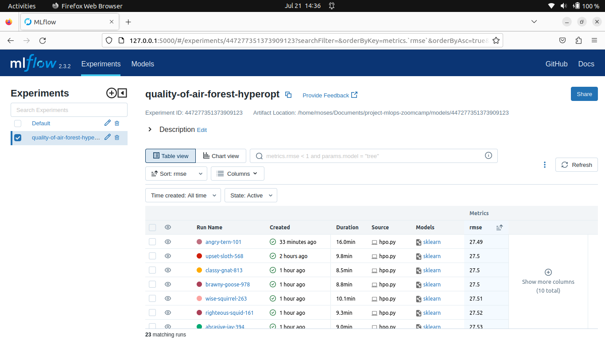
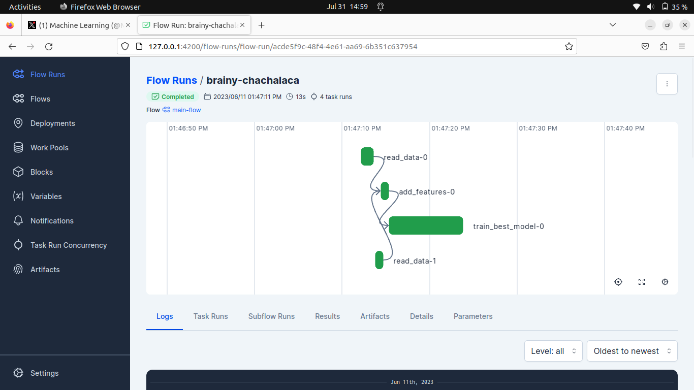

# project-mlops-zoomcamp
This is the capstone project for my mlops-zoomcamp course with datatalks

# Capstone Project (Mlops-Zoomcamp) - Urban Air Quality Prediction


## Problem Statement

This is a capstone project associated with [MLOps Zoomcamp](https://github.com/DataTalksClub/mlops-zoomcamp), and it will be peer reviewed and scored.

Air pollution is a critical global issue affecting the health and well-being of millions of people. The World Health Organization (WHO) estimates that more than 90% of the world's population lives in areas with air quality levels exceeding their guidelines, leading to numerous health problems, including respiratory and cardiovascular diseases. Therefore, it is imperative to develop accurate and efficient methods to monitor and predict air quality in cities worldwide.

The objective of this machine learning project is to create a predictive model that leverages satellite data to estimate PM2.5 particulate matter concentration in the air every day for each city. PM2.5 refers to atmospheric particulate matter that have a diameter of less than 2.5 micrometers and is one of the most harmful air pollutants. PM2.5 is a common measure of air quality that normally requires ground-based sensors to measure.

The successful completion of this project will lead to a powerful tool for predicting air quality in cities worldwide, helping local governments and environmental agencies take proactive measures to address pollution and safeguard public health. Moreover, it can provide valuable insights into the spatial and temporal patterns of air pollution, aiding in the development of effective mitigation strategies and sustainable urban planning.

## Dataset

The data covers the last three months, spanning hundreds of cities across the globe.

The data comes from three main sources:

1. Ground-based air quality sensors. These measure the target variable (PM2.5 particle concentration). In addition to the target column (which is the daily mean concentration) there are also columns for minimum and maximum readings on that day, the variance of the readings and the total number (count) of sensor readings used to compute the target value. This data is only provided for the train set - you must predict the target variable for the test set.
2. The Global Forecast System (GFS) for weather data. Humidity, temperature and wind speed, which can be used as inputs for your model.
3. The Sentinel 5P satellite. This satellite monitors various pollutants in the atmosphere. For each pollutant, we queried the offline Level 3 (L3) datasets available in Google Earth Engine (you can read more about the individual products here: https://developers.google.com/earth-engine/datasets/catalog/sentinel-5p). For a given pollutant, for example NO2, we provide all data from the Sentinel 5P dataset for that pollutant. This includes the key measurements like NO2_column_number_density (a measure of NO2 concentration) as well as metadata like the satellite altitude. We recommend that you focus on the key measurements, either the column_number_density or the tropospheric_X_column_number_density (which measures density closer to Earth’s surface).
Unfortunately, this data is not 100% complete. Some locations have no sensor readings for a particular day, and so those rows have been excluded. There are also gaps in the input data, particularly the satellite data for CH4.

The Following data dictionary gives more details on this data set:

---

| Place_ID X Date      | Date                | Place_ID   |   target |   target_min |   target_max |   target_variance |   target_count |   precipitable_water_entire_atmosphere |   relative_humidity_2m_above_ground |   specific_humidity_2m_above_ground |   temperature_2m_above_ground |   u_component_of_wind_10m_above_ground |   v_component_of_wind_10m_above_ground |   L3_NO2_NO2_column_number_density |   L3_NO2_NO2_slant_column_number_density |   L3_NO2_absorbing_aerosol_index |   L3_NO2_cloud_fraction |   L3_NO2_sensor_altitude |   L3_NO2_sensor_azimuth_angle |   L3_NO2_sensor_zenith_angle |   L3_NO2_solar_azimuth_angle |   L3_NO2_solar_zenith_angle |   L3_NO2_stratospheric_NO2_column_number_density |   L3_NO2_tropopause_pressure |   L3_NO2_tropospheric_NO2_column_number_density |   L3_O3_O3_column_number_density |   L3_O3_O3_effective_temperature |   L3_O3_cloud_fraction |   L3_O3_sensor_azimuth_angle |   L3_O3_sensor_zenith_angle |   L3_O3_solar_azimuth_angle |   L3_O3_solar_zenith_angle |   L3_CO_CO_column_number_density |   L3_CO_H2O_column_number_density |   L3_CO_cloud_height |   L3_CO_sensor_altitude |   L3_CO_sensor_azimuth_angle |   L3_CO_sensor_zenith_angle |   L3_CO_solar_azimuth_angle |   L3_CO_solar_zenith_angle |   L3_HCHO_HCHO_slant_column_number_density |   L3_HCHO_cloud_fraction |   L3_HCHO_sensor_azimuth_angle |   L3_HCHO_sensor_zenith_angle |   L3_HCHO_solar_azimuth_angle |   L3_HCHO_solar_zenith_angle |   L3_HCHO_tropospheric_HCHO_column_number_density |   L3_HCHO_tropospheric_HCHO_column_number_density_amf |   L3_CLOUD_cloud_base_height |   L3_CLOUD_cloud_base_pressure |   L3_CLOUD_cloud_fraction |   L3_CLOUD_cloud_optical_depth |   L3_CLOUD_cloud_top_height |   L3_CLOUD_cloud_top_pressure |   L3_CLOUD_sensor_azimuth_angle |   L3_CLOUD_sensor_zenith_angle |   L3_CLOUD_solar_azimuth_angle |   L3_CLOUD_solar_zenith_angle |   L3_CLOUD_surface_albedo |   L3_AER_AI_absorbing_aerosol_index |   L3_AER_AI_sensor_altitude |   L3_AER_AI_sensor_azimuth_angle |   L3_AER_AI_sensor_zenith_angle |   L3_AER_AI_solar_azimuth_angle |   L3_AER_AI_solar_zenith_angle |   L3_SO2_SO2_column_number_density |   L3_SO2_SO2_column_number_density_amf |   L3_SO2_SO2_slant_column_number_density |   L3_SO2_absorbing_aerosol_index |   L3_SO2_cloud_fraction |   L3_SO2_sensor_azimuth_angle |   L3_SO2_sensor_zenith_angle |   L3_SO2_solar_azimuth_angle |   L3_SO2_solar_zenith_angle |   L3_CH4_CH4_column_volume_mixing_ratio_dry_air |   L3_CH4_aerosol_height |   L3_CH4_aerosol_optical_depth |   L3_CH4_sensor_azimuth_angle |   L3_CH4_sensor_zenith_angle |   L3_CH4_solar_azimuth_angle |   L3_CH4_solar_zenith_angle |
|:---------------------|:--------------------|:-----------|---------:|-------------:|-------------:|------------------:|---------------:|---------------------------------------:|------------------------------------:|------------------------------------:|------------------------------:|---------------------------------------:|---------------------------------------:|-----------------------------------:|-----------------------------------------:|---------------------------------:|------------------------:|-------------------------:|------------------------------:|-----------------------------:|-----------------------------:|----------------------------:|-------------------------------------------------:|-----------------------------:|------------------------------------------------:|---------------------------------:|---------------------------------:|-----------------------:|-----------------------------:|----------------------------:|----------------------------:|---------------------------:|---------------------------------:|----------------------------------:|---------------------:|------------------------:|-----------------------------:|----------------------------:|----------------------------:|---------------------------:|-------------------------------------------:|-------------------------:|-------------------------------:|------------------------------:|------------------------------:|-----------------------------:|--------------------------------------------------:|------------------------------------------------------:|-----------------------------:|-------------------------------:|--------------------------:|-------------------------------:|----------------------------:|------------------------------:|--------------------------------:|-------------------------------:|-------------------------------:|------------------------------:|--------------------------:|------------------------------------:|----------------------------:|---------------------------------:|--------------------------------:|--------------------------------:|-------------------------------:|-----------------------------------:|---------------------------------------:|-----------------------------------------:|---------------------------------:|------------------------:|------------------------------:|-----------------------------:|-----------------------------:|----------------------------:|------------------------------------------------:|------------------------:|-------------------------------:|------------------------------:|-----------------------------:|-----------------------------:|----------------------------:|
| 010Q650 X 2020-01-02 | 2020-01-02 00:00:00 | 010Q650    |       38 |           23 |           53 |            769.5  |             92 |                               11       |                                60.2 |                             0.00804 |                       18.5168 |                                1.99638 |                               -1.22739 |                        7.38304e-05 |                              0.00015582  |                        -1.23133  |               0.0065068 |                   840210 |                       76.5375 |                    38.6343   |                     -61.7367 |                     22.3582 |                                      5.67927e-05 |                      6156.07 |                                     1.70377e-05 |                         0.119095 |                          234.151 |              0         |                      76.5364 |                   38.593    |                    -61.7526 |                    22.3637 |                        0.0210803 |                           883.332 |             267.017  |                  840138 |                      74.5434 |                    38.6225  |                    -61.789  |                    22.3791 |                               -1.04126e-05 |                0         |                        76.5364 |                     38.593    |                      -61.7526 |                      22.3637 |                                       6.3888e-05  |                                              0.566828 |                       38     |                           38   |                 0         |                       38       |                      38     |                          38   |                         76.5364 |                      38.593    |                       -61.7526 |                       22.3637 |                 38        |                           -1.23133  |                      840210 |                          76.5375 |                       38.6343   |                        -61.7367 |                        22.3582 |                       -0.000126854 |                               0.312521 |                             -4.04658e-05 |                        -1.86148  |               0         |                       76.5364 |                    38.593    |                     -61.7526 |                     22.3637 |                                         1793.79 |                 3227.86 |                      0.010579  |                        74.481 |                      37.5015 |                     -62.1426 |                     22.5451 |
| 010Q650 X 2020-01-03 | 2020-01-03 00:00:00 | 010Q650    |       39 |           25 |           63 |           1319.85 |             91 |                               14.6     |                                48.8 |                             0.00839 |                       22.5465 |                                3.33043 |                               -1.18811 |                        7.60326e-05 |                              0.000196866 |                        -1.08255  |               0.01836   |                   840773 |                      -14.708  |                    59.6249   |                     -67.6935 |                     28.6148 |                                      5.46511e-05 |                      6156.07 |                                     2.13815e-05 |                         0.115179 |                          233.314 |              0.0594329 |                     -14.708  |                   59.6249   |                    -67.6935 |                    28.6148 |                        0.0220167 |                          1148.99  |              61.2167 |                  841117 |                     -57.0152 |                    61.4026  |                    -74.4576 |                    33.0895 |                                0.000114448 |                0.0594329 |                       -14.708  |                     59.6249   |                      -67.6935 |                      28.6148 |                                       0.000170987 |                                              0.858446 |                      175.02  |                        99354.2 |                 0.0593581 |                        5.95854 |                     175.072 |                       99353.7 |                        -14.708  |                      59.6249   |                       -67.6935 |                       28.6148 |                  0.315403 |                           -1.08255  |                      840773 |                         -14.708  |                       59.6249   |                        -67.6935 |                        28.6148 |                        0.000150296 |                               0.433957 |                              5.0211e-05  |                        -1.45261  |               0.0594329 |                      -14.708  |                    59.6249   |                     -67.6935 |                     28.6148 |                                         1789.96 |                 3384.23 |                      0.0151044 |                        75.63  |                      55.6575 |                     -53.8681 |                     19.2937 |
| 010Q650 X 2020-01-04 | 2020-01-04 00:00:00 | 010Q650    |       24 |            8 |           56 |           1181.96 |             96 |                               16.4     |                                33.4 |                             0.0075  |                       27.031  |                                5.06573 |                                3.50056 |                        6.66078e-05 |                              0.000170418 |                        -1.00124  |               0.0159039 |                   841411 |                     -105.201  |                    49.8397   |                     -78.3427 |                     34.297  |                                      5.91257e-05 |                      7311.87 |                                     7.48202e-06 |                         0.115876 |                          232.233 |              0.082063  |                    -105.201  |                   49.8397   |                    -78.3427 |                    34.297  |                        0.0206767 |                          1109.35  |             134.7    |                  841320 |                    -103.494  |                    49.9246  |                    -78.3551 |                    34.3089 |                                2.68109e-05 |                0.082063  |                      -105.201  |                     49.8397   |                      -78.3427 |                      34.297  |                                       0.0001239   |                                              0.910536 |                      275.904 |                        98118.9 |                 0.0822465 |                        5.75576 |                     508.978 |                       95671.4 |                       -105.201  |                      49.8397   |                       -78.3427 |                       34.297  |                  0.307463 |                           -1.00124  |                      841411 |                        -105.201  |                       49.8397   |                        -78.3427 |                        34.297  |                        0.000150096 |                               0.356925 |                              5.29488e-05 |                        -1.57295  |               0.082063  |                     -105.201  |                    49.8397   |                     -78.3427 |                     34.297  |                                           32    |                   32    |                     32         |                        32     |                      32      |                      32      |                     32      |
| 010Q650 X 2020-01-05 | 2020-01-05 00:00:00 | 010Q650    |       49 |           10 |           55 |           1113.67 |             96 |                                6.91195 |                                21.3 |                             0.00391 |                       23.9719 |                                3.004   |                                1.09947 |                        8.25818e-05 |                              0.000174859 |                        -0.777019 |               0.0557655 |                   841103 |                     -104.334  |                    29.181    |                     -73.8966 |                     30.5454 |                                      5.95394e-05 |                     11205.4  |                                     2.30247e-05 |                         0.141557 |                          230.936 |              0.121261  |                    -104.334  |                   29.1813   |                    -73.8966 |                    30.5454 |                        0.0212071 |                          1061.57  |             474.821  |                  841036 |                    -101.956  |                    29.215   |                    -73.9146 |                    30.5445 |                                2.34869e-05 |                0.121261  |                      -104.334  |                     29.1813   |                      -73.8966 |                      30.5454 |                                       8.07577e-05 |                                              1.13257  |                      383.692 |                        97258.5 |                 0.121555  |                        6.24689 |                     495.38  |                       96232.5 |                       -104.334  |                      29.1813   |                       -73.8966 |                       30.5454 |                  0.279637 |                           -0.777023 |                      841103 |                        -104.334  |                       29.181    |                        -73.8966 |                        30.5454 |                        0.000227213 |                               0.584522 |                              0.000109705 |                        -1.23932  |               0.121261  |                     -104.334  |                    29.1813   |                     -73.8966 |                     30.5454 |                                           32.5  |                   32.5  |                     32.5       |                        32.5   |                      32.5    |                      32.5    |                     32.5    |
| 010Q650 X 2020-01-06 | 2020-01-06 00:00:00 | 010Q650    |       21 |            9 |           52 |           1164.82 |             95 |                               13.9     |                                44.7 |                             0.00535 |                       16.8163 |                                2.62179 |                                2.67056 |                        7.03848e-05 |                              0.000141551 |                         0.366323 |               0.0285296 |                   840763 |                       58.8502 |                     0.797294 |                     -68.6125 |                     26.8997 |                                      6.16401e-05 |                     11205.4  |                                     8.74477e-06 |                         0.126369 |                          232.499 |              0.0379194 |                      58.8502 |                    0.797294 |                    -68.6125 |                    26.8997 |                        0.0377656 |                          1044.25  |             926.926  |                  840710 |                      15.4996 |                     1.38908 |                    -68.6229 |                    26.9062 |                                3.72496e-05 |                0.0379194 |                        58.8502 |                      0.797294 |                      -68.6125 |                      26.8997 |                                       0.000140219 |                                              0.649359 |                     4314.48  |                        59875   |                 0.0370076 |                        4.20569 |                    5314.48  |                       52561.5 |                         58.8502 |                       0.797294 |                       -68.6125 |                       26.8997 |                  0.238241 |                            0.366324 |                      840763 |                          58.8502 |                        0.797294 |                        -68.6125 |                        26.8997 |                        0.000389767 |                               0.408047 |                              0.00015891  |                         0.202489 |               0.0379194 |                       58.8502 |                     0.797294 |                     -68.6125 |                     26.8997 |                                           30.5  |                   30.5  |                     30.5       |                        30.5   |                      30.5    |                      30.5    |                     30.5    |

## Flow

- [x] Experiment Training & Tracking , orchestration, Tracking, Model Registry & Deployment
```bash
Mlflow - Experiment Training & Tracking
```



Model deployed as an API through docker and AWS