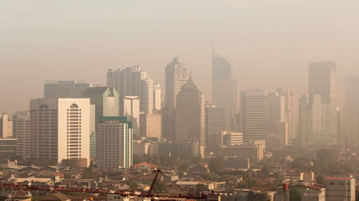

# project-mlops-zoomcamp
This is the capstone project for my mlops-zoomcamo course with datatalks

# Capstone Project (Mlops-Zoomcamp) - Urban Air Quality Prediction

## Problem Statement

This is a capstone project associated with [MLOps Zoomcamp](https://github.com/DataTalksClub/mlops-zoomcamp), and it will be peer reviewed and scored.

Air pollution is a critical global issue affecting the health and well-being of millions of people. The World Health Organization (WHO) estimates that more than 90% of the world's population lives in areas with air quality levels exceeding their guidelines, leading to numerous health problems, including respiratory and cardiovascular diseases. Therefore, it is imperative to develop accurate and efficient methods to monitor and predict air quality in cities worldwide.

The objective of this machine learning project is to create a predictive model that leverages satellite data to estimate PM2.5 particulate matter concentration in the air every day for each city. PM2.5 refers to atmospheric particulate matter that have a diameter of less than 2.5 micrometers and is one of the most harmful air pollutants. PM2.5 is a common measure of air quality that normally requires ground-based sensors to measure.

The successful completion of this project will lead to a powerful tool for predicting air quality in cities worldwide, helping local governments and environmental agencies take proactive measures to address pollution and safeguard public health. Moreover, it can provide valuable insights into the spatial and temporal patterns of air pollution, aiding in the development of effective mitigation strategies and sustainable urban planning.

